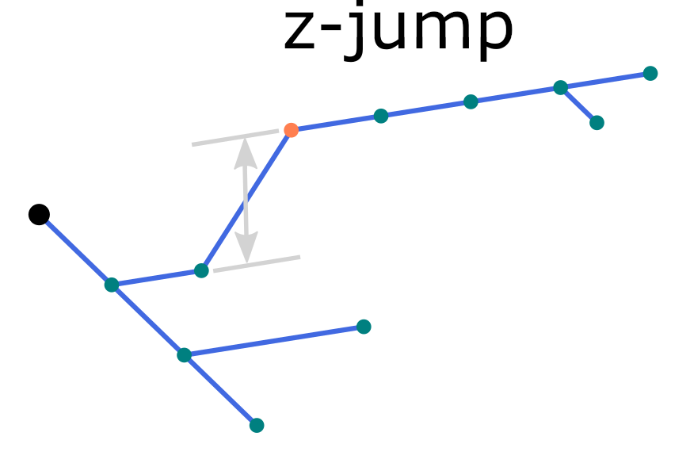
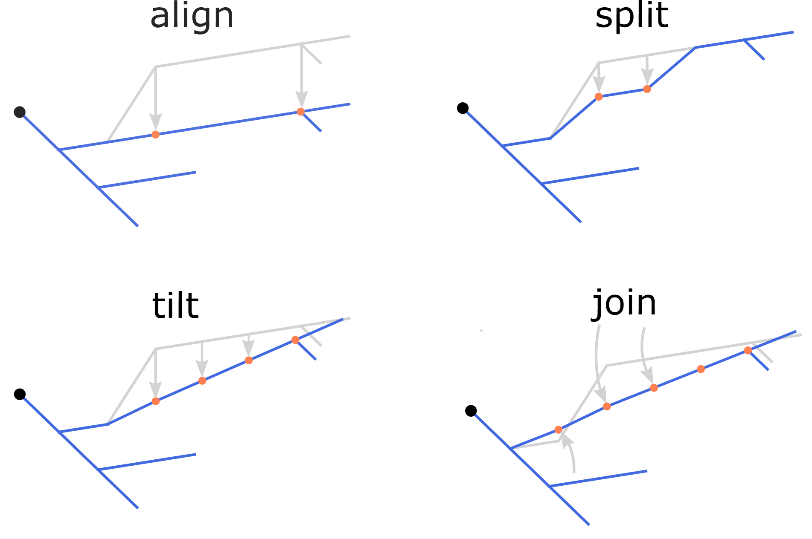
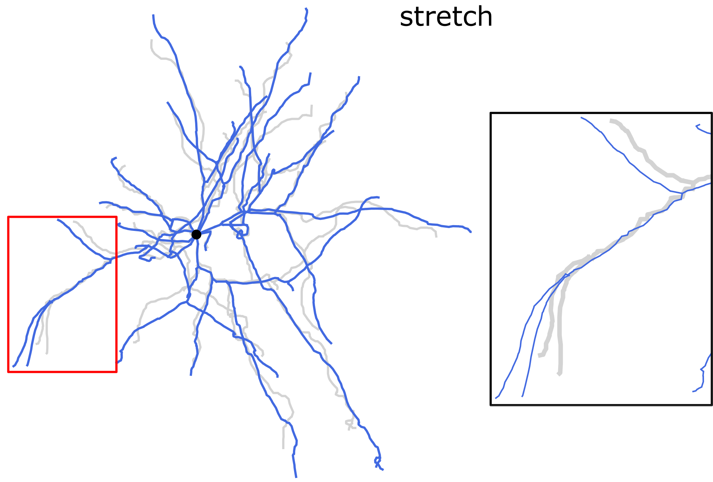
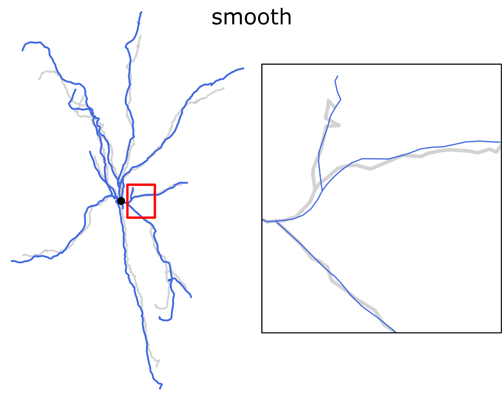
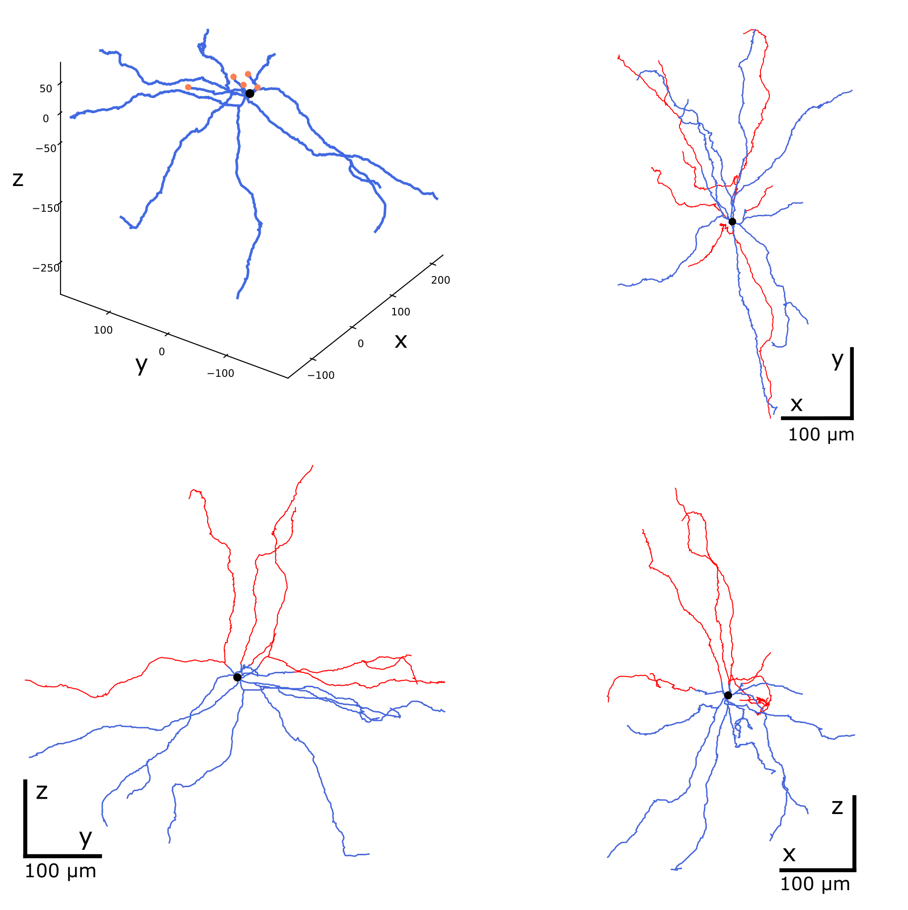
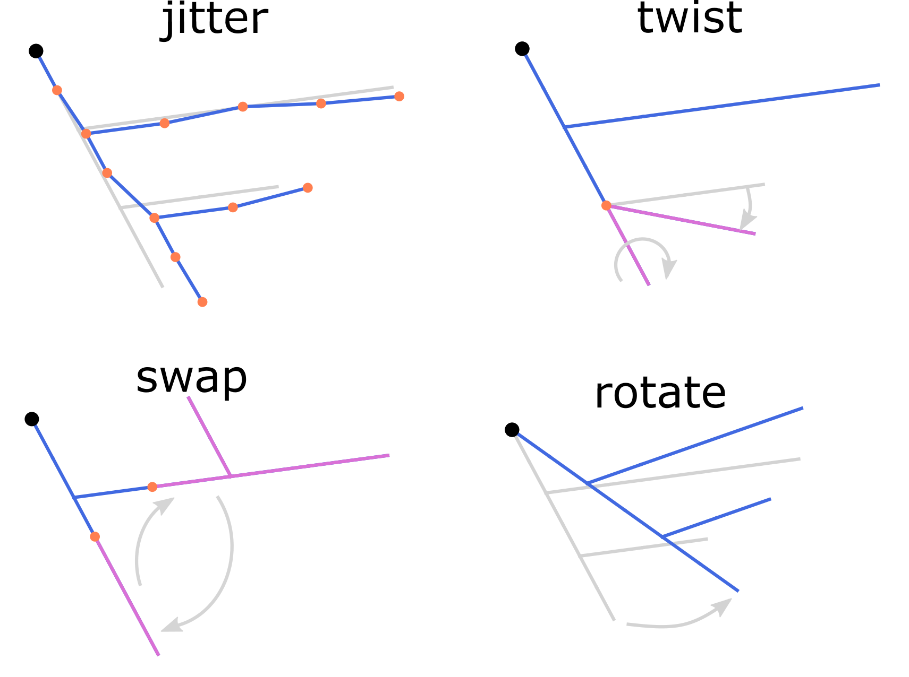
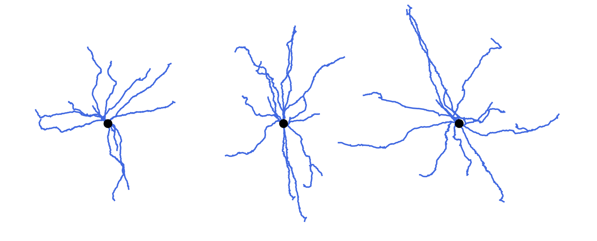
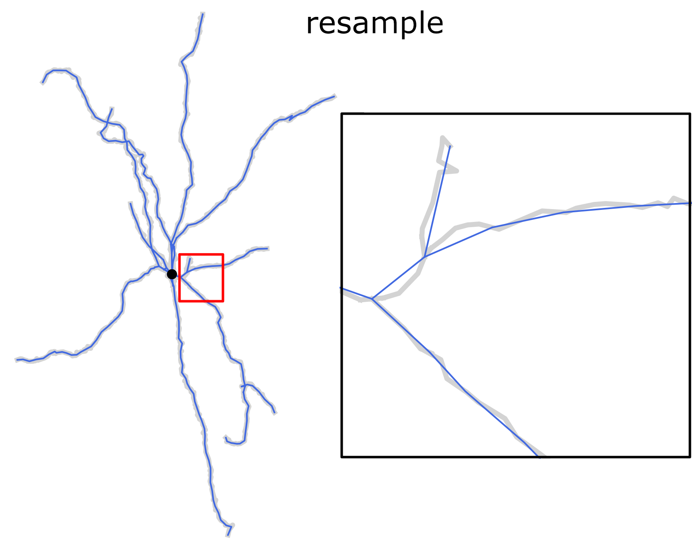

Usage examples
==============

Procedures and scenarios described here present few typical use cases in
manipulation of the neuron morphology reconstructions supported by the
module ``treem``. The module should be installed and accessible. Check
that the importing works and returns no error::

    python3 -c "import treem"

A Python version 3.7 or greater is assumed here. Make sure the files from
``tests/data/`` in the module's source tree are copied to the working
directory.

API use cases
-------------

.. rubric:: Loading the reconstruction

>>> from treem import Morph
>>> m = Morph('pass_simple_branch.swc')
>>> m.data
array([[ 1. ,  1. ,  0. ,  0. ,  0. ,  1. , -1. ],
       [ 2. ,  3. ,  1. ,  1. ,  0. ,  0.2,  1. ],
       [ 3. ,  3. ,  2. ,  2. ,  0. ,  0.2,  2. ],
       [ 4. ,  3. ,  1. ,  3. ,  0. ,  0.2,  3. ],
       [ 5. ,  3. ,  0. ,  4. ,  0. ,  0.02,  4. ],
       [ 6. ,  3. , -1. ,  5. ,  0. ,  0.2,  5. ],
       [ 7. ,  3. , -2. ,  6. ,  0. ,  0.2,  6. ],
       [ 8. ,  3. ,  3. ,  3. ,  0. ,  0.2,  3. ],
       [ 9. ,  3. ,  4. ,  4. ,  0. ,  0.2,  8. ],
       [10. ,  3. ,  3. ,  5. ,  0. ,  0.2,  9. ],
       [11. ,  3. ,  2. ,  6. ,  0. ,  0.2, 10. ],
       [12. ,  3. ,  5. ,  5. ,  0. ,  0.2,  9. ],
       [13. ,  3. ,  6. ,  6. ,  0. ,  0.2, 12. ]])

.. rubric:: Traversing the tree

Traverse the tree starting from the root node.

>>> start_node = m.root
>>> [node.ident() for node in start_node.walk()]
[1, 2, 3, 4, 5, 6, 7, 8, 9, 10, 11, 12, 13]

Traverse the tree starting from the node with ID 8.

>>> start_node = m.node(8)
>>> [node.ident() for node in start_node.walk()]
[8, 9, 10, 11, 12, 13]

By default the tree is traversed in the descending order. In the
above example a sub-tree (a branch) which starts at node with ID 8
is iterated. To walk the tree in ascending order, set the ``reverse``
argument of ``treem.Node.walk()``.

>>> [node.ident() for node in start_node.walk(reverse=True)]
[8, 3, 2, 1]

Note that the full tree is not traversed when ``reverse`` is set: the
iterations stop as soon as the root node is reached (ID 1).

The data stored at each node can be accessed during the tree
traversal. Calculate the total length of the branch from the
``start_node``:

>>> sum(node.length() for node in start_node.walk())
8.485281374238571

An alternative way of traversing the tree is iterating through the
sections (in descending order):

>>> for sec in start_node.sections():
>>>     print([node.ident() for node in sec])
[8, 9]
[10, 11]
[12, 13]

The total length of the branch calculated this way will be the same:

>>> sum(m.length(sec) for sec in start_node.sections())
8.485281374238571

CLI use cases
-------------

.. rubric:: Checking the input file

Check the input SWC file for structural consistency and compliance
with the format requirements implied by the module ``treem``. For
example, records in the file ``fail_unordered.swc`` are not in the proper
order so the `check` command reports problems::

    swc check fail_unordered.swc

.. program-output:: bash -c "swc check ../../tests/data/fail_unordered.swc || true"

.. rubric:: Converting the input file

Try to convert the input file to the compliant format. If there are
no critical mistakes in the file structure, the conversion completes
without errors::

    swc convert fail_unordered.swc -o out.swc

.. program-output:: swc convert ../../tests/data/fail_unordered.swc -o /dev/null

Check that the output file is fine::

    swc check out.swc

.. rubric:: Displaying the morphology

Command `view` displays the structure of the morphology reconstruction. It
only shows the center line of the reconstructed segments without their
diameters::

    swc view pass_nmo_1.swc

The root node is shown with the bold black dot; the soma points are
shown with semitransparent spherical markers; colored lines correspond
to the neurites of different types.

To display multiple cells, change the color mode to colorize individual
cells::

    swc view -c cells pass_mouselight_1.swc pass_mouselight_2.swc

.. rubric:: Measuring morphometry of the reconstruction

Command `measure` prints out basic morphometric features of the reconstruction::

    swc measure pass_nmo_1.swc

.. program-output:: bash -c "swc measure ../../tests/data/pass_nmo_1.swc | head; echo [...]; swc measure ../../tests/data/pass_nmo_1.swc | tail"

.. rubric:: Locating single nodes

Command `find` helps to locate single nodes satisfying multiple search
criteria. For example, to find a node within the dendrites (point type 3)
with the diameter less than 0.1 micrometer, run the following::

    swc find pass_simple_branch.swc -p 3 -d 0.1 --comp lt

.. program-output:: swc find ../../tests/data/pass_simple_branch.swc -p 3 -d 0.1 --comp lt

The following command searches for the nodes of topological order 1
(which belong to the primary neurite sections)::

    swc find pass_simple_branch.swc -e 1

And this `bash` command displays the terminal sections of the dendrites::

    swc view pass_simple_branch.swc -b `swc find pass_simple_branch.swc -p 3 -b 1 --sec`

.. rubric:: Repairing damaged reconstructions

A common reconstruction error is so called `z-jump` when a part of the
neurite gets shifted along the `z`-axis by few micrometers.

   An illustration of z-jump in the morphology reconstruction.

To locate z-jumps greater than 10 micrometers, run the command `find`::

    swc find pass_zjump.swc -z 10

.. program-output:: swc find ../../tests/data/pass_zjump.swc -z 10

Possible z-jumps can be eliminated by the `repair` command using one of
the four methods, `align`, `split`, `tilt` or `join` (defaults to
`align`), as illustrated in the figure. Repair z-jumps::

    swc repair pass_zjump.swc --zjump join -z `swc find pass_zjump.swc -z 10`

   The four methods of correcting z-jumps.

Experimental protocols of the slice preparation may lead to the tissue
shrinkage. Due to the shrinkage, morphology reconstructions become smaller
with increased contraction of the neurites in comparison to `in vivo`
conditions.  To compensate for the shrinkage, various options of the
commands `repair` and `modify` can be used. See options ``-s``, ``-t``
and ``-m`` of the command `modify` for scaling, stretching and smoothing,
respectively, and options ``-k`` and ``-kxy`` of the command `repair`
for the shrinkage correction in `z` and `(x, y)` directions, respectively.

   Stretching the dendrites along the direction of each dendritic
   section. Length-preserving operation.

   Smoothing the dendrites with the rolling average spatial
   filter. Length-preserving operation.

Morphological reconstructions of the neurons located close to the
surface of the preparation are often incomplete, missing the neurites cut by
the tissue slicing. The cut points of the dendrites can be located using
command `find`::

    swc find pass_nmo_2_cut.swc -c 10 -p 3

.. program-output:: swc find ../../tests/data/pass_nmo_2_cut.swc -c 10 -p 3

Here we assume the cut points are within 10 micrometers from the top surface
of the slice along the `z`-axis. To invert the surface orientation,
add the option ``--bottom-up``.

Inspect the cut points in the projection and note the ID numbers
for repair::

    swc view pass_nmo_2_cut.swc -p 3 -j xz --show-id -m `swc find pass_nmo_2_cut.swc -c 10 -p 3`

If all cut points are located correctly, pass them all to the repair procedure::

    swc repair pass_nmo_2_cut.swc -c `swc find pass_nmo_2_cut.swc -c 10 -p 3`

Alternatively, pass selected IDs to the option ``-c`` of the command `repair`.

The repaired reconstruction ``rep.swc`` can be compared to the original
using the command `view` with ``-c shadow`` option::

    swc view pass_nmo_2_cut.swc rep.swc -p 3 -c shadow

   Repairing cut neurites. The cut points are orange, the repaired
   branches are red.

With option ``-c shadow`` the second and all subsequent morphologies
are plotted as underlying structures with the first morphology on top of
them. The default shadow color is `lightgray` and the line width `3.0`. To
make a plot as in the figure above, issue the following command::

    swc view pass_nmo_2_cut.swc rep.swc -p 3 -c shadow --shadow-color red --shadow-width 0.5

.. rubric:: Modifying morphologies

Correct or repaired morphology reconstructions may need further
modifications before entering the simulation pipeline. A typical example
is cloning of the finished reconstructions with random manipulation
of their neurites. This increases variability within the population of
morphologies keeping its topological structure and statistical features,
as shown in the figure. See the corresponding options of the commands
`modify` and `repair`.

   Length-preserving modifications of the morphology reconstructions.

Morphology modifications are used for cloning the available
reconstructions to achieve higher morphological variability in the
simulations. Let's take as an example the random morphology created by
the command `repair` as in the section above::

    swc repair pass_nmo_2_cut.swc -c `swc find pass_nmo_2_cut.swc -c 10 -p 3` --seed 123

We modify repaired morphology ``rep.swc`` by twisting dendrites at the
branching points to a random angle up to 360 degrees and then scale the
resulting morphology ``mod.swc`` in (x, y, z) by the factor of 0.8. The
result is saved into ``clone1.swc``::

    swc modify rep.swc -p 3 -w 360
    swc modify mod.swc -s 0.8 0.8 0.8 -o clone1.swc

Likewise, we twist dendrites of ``rep.swc`` and scale it by 1.2, creating
morphology ``clone2.swc``::

    swc modify rep.swc -p 3 -w 360
    swc modify mod.swc -s 1.2 1.2 1.2 -o clone2.swc

   Cloning morphologies with random modifications. Original morphology
   in the middle. Cloned morphologies have the dendrites twisted randomly
   at the branching points and scaled by the factor of 0.8 (on the left)
   and 1.2 (on the right).

Finally, ready reconstructions can be resampled with fixed spatial
resolution. This operation preserves position of the structure-defining
points (`i.e.` neurite stem points, branching points and terminals)
but slightly reduces the total length.

   Resampling morphology reconstruction with fixed spatial
   resolution. Structure points-preserving operation.

For the full list of available options provided by module ``treem``,
see :ref:`cli:Command-line interface` and :ref:`api:API reference`.

