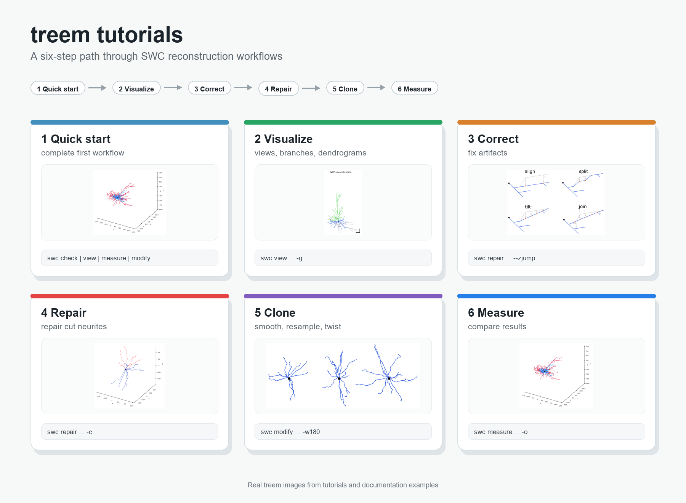

# Tutorials

Start with `1_quick_start.ipynb`, then use the focused tutorials to look more closely at each part of the workflow.

| Tutorial | Focus |
| --- | --- |
| `1_quick_start.ipynb` | Run a first complete workflow |
| `2_visualize_reconstructions.ipynb` | Create clear reconstruction views |
| `3_correct_reconstruction.ipynb` | Correct diameter, z-jump, and shrinkage artifacts |
| `4_repair_reconstruction.ipynb` | Find cut points and repair a reconstruction |
| `5_clone_reconstruction.ipynb` | Smooth, resample, and clone a reconstruction |
| `6_measure_and_compare.ipynb` | Measure files and compare results |

The notebooks use terminal commands through small code cells and write temporary files to `data/` and `output/`.
